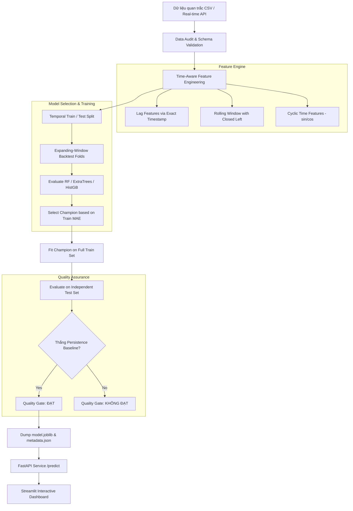

# 🌫️ Leakage-Safe Next-Hour PM2.5 Forecasting for Ho Chi Minh City

Dự án portfolio mô phỏng vòng đời kỹ thuật của một hệ thống **Dự báo nồng độ PM2.5 giờ tiếp theo (\(t+1\))** theo từng trạm quan trắc tại TP.HCM. Dự án tập trung vào kiểm tra dữ liệu, feature engineering theo timestamp, expanding-window validation, baseline comparison, Quality Gate tự động, Split Conformal prediction intervals, API, dashboard, Docker và CI.

> ⚠️ **Tuyên bố miễn trừ:** Các mức Thấp/Trung bình/Cao trong dự án là nhóm phân tích nội bộ thử nghiệm, không phải chỉ số AQI chính thức hoặc khuyến nghị y tế.

---

## 🎯 Định Nghĩa Bài Toán (Problem Definition)

Tại thời điểm $t$, sử dụng dữ liệu quan trắc đã biết đến hết thời điểm $t$ của một trạm duy nhất để dự báo nồng độ PM2.5 tại mốc $t+1$ giờ.

### Đầu vào hợp lệ (Valid Input Constraints):
- **Một trạm duy nhất** per request.
- **Timestamp tăng dần**, liên tục từng giờ ($\Delta t = 1\text{h}$).
- **Không trùng mốc timestamp**.
- **PM2.5 hiện tại phải tồn tại** và không âm ($\ge 0$).
- **Tối thiểu 25 giờ lịch sử liên tục** (khi sử dụng lag 24 giờ).
- Các chất ngoại sinh ($O_3$, $SO_2$, $NO_2$, $CO$, $TSP$, nhiệt độ, độ ẩm) có thể thiếu.

### Cấu trúc Output chuẩn hóa (Standard Output Schema):
```json
{
  "station": "Trạm A",
  "forecast_origin": "2024-01-01T10:00:00",
  "forecast_for": "2024-01-01T11:00:00",
  "current_pm25": 32.1,
  "predicted_pm25": 34.7,
  "level": "Trung bình",
  "interval": {
    "lower": 29.2,
    "upper": 40.1,
    "coverage": 0.9
  },
  "model_version": "2026-09-01-001",
  "updated_at": "2024-01-01T10:00:05Z"
}
```

- `forecast_origin`: Mốc thời điểm hiện tại $t$ của dữ liệu quan trắc.
- `forecast_for`: Mốc thời điểm $t+1$ được dự báo.
- `updated_at`: Thời điểm API trả kết quả phản hồi.

---

## 🌟 Điểm Nổi Bật Kỹ Thuật (Key Technical Highlights)

- 🔒 **Chống Leakage Dữ Liệu Biên Target & Partition**:
  - Tra cứu lag (1, 2, 3, 6, 12, 24 giờ) và rolling features theo mốc thời gian thực (`timestamp`), không dịch vị trí dòng.
  - Sửa leakage tại biên split: Mốc `target_timestamp` ($t+1\text{h}$) của dữ liệu train **luôn nhỏ hơn** mốc bắt đầu của tập validation/test (`target_timestamp < test_start`).
- 📊 **Phân Biệt Mục Tiêu Hồi Quy & Diễn Giải**:
  - Mục tiêu chính là bài toán hồi quy nồng độ PM2.5. Phân lớp nhãn Thấp/Trung bình/Cao chỉ là bước diễn giải phụ.
- 📐 **Split Conformal Prediction Interval**:
  - Thay thế chỉ số tự tạo (tree confidence heuristic) bằng khoảng dự báo chuẩn mực **Split Conformal Prediction** ($\text{coverage} = 0.90$) tính từ residual quantile 90% ở tập validation.
- 🏆 **Quality Gate & Baseline Persistence Rule**:
  - So sánh trực tiếp với 2 baseline: **Persistence** ($t+1 = t$) và **Seasonal Naive 24h** ($t+1 = t-23h$).
  - Quality Gate tự động đánh giá: $MAE_{\text{model}} \le MAE_{\text{persistence}} \times 0.95$, Recall nhóm PM2.5 cao $\ge 0.75$, và Rolling MAE Std $\le 1.0$.
  - Nếu mô hình học máy không vượt được baseline, hệ thống tự động gắn cờ fallback chọn persistence làm champion phục vụ suy luận.
- 🚀 **Kiến Trúc Software Engineering & MLOps**:
  - **FastAPI**: Pydantic input validation (tối thiểu 25, tối đa 168 observations), phân loại status code (400, 422, 503, 500) và `/health` check.
  - **Streamlit Dashboard**: Hiển thị chuỗi 24h, mốc dự báo $t+1$, khoảng tin cậy 90% Conformal và cảnh báo chất lượng dữ liệu.
  - **Docker & Lockfiles**: Tách biệt bước huấn luyện khỏi container serving, cài đặt từ dependencies đã khóa (`requirements.lock`).

---

## 🏗️ Kiến Trúc Hệ Thống (System Architecture)



---

## 🛠️ Hướng Dẫn Cài Đặt & Chạy (Quick Start)

### Chạy và tái lập kết quả trên Google Colab

[](https://colab.research.google.com/github/haminhthong/hcmc-pm25-forecasting/blob/main/notebooks/02_colab_reproducibility.ipynb)

Notebook Colab tự clone repository, cài các phiên bản thư viện đã khóa trong `requirements-colab.txt`, chạy trực tiếp pipeline `src.train` và đối chiếu kết quả với snapshot chuẩn. Cách này bảo đảm notebook và CLI không duy trì hai bản logic huấn luyện khác nhau.

Khi repository chưa được đẩy lên GitHub, có thể mở notebook cục bộ bằng Jupyter; notebook sẽ tự tìm thư mục gốc chứa `pyproject.toml`.

### 1. Khởi tạo môi trường Python (Python 3.11+)

```bash
# Tạo và kích hoạt môi trường ảo
python -m venv .venv

# Windows PowerShell:
.venv\Scripts\activate

# Linux / macOS:
# source .venv/bin/activate

# Cài đặt thư viện phát triển
pip install -r requirements-dev.txt
```

### 2. Kiểm tra chất lượng mã nguồn & Unit Tests

```bash
# Linting với Ruff
python -m ruff check src app tests

# Chạy toàn bộ Unit Tests
python -m pytest

# Test toàn bộ pipeline huấn luyện (Dry-run không ghi artifact)
python -m src.train --config configs/config.yaml --dry-run
```

### 3. Huấn luyện & Đánh giá Mô hình

```bash
# Chạy pipeline huấn luyện thực tế và lưu artifacts
python -m src.train --config configs/config.yaml

# Trích xuất báo cáo Markdown
python -m src.report --input artifacts/evaluation.json --output reports/evaluation_summary.md
```

Artifacts sẽ được sinh ra trong thư mục `artifacts/`:
- `artifacts/model.joblib`: Pipeline mô hình học máy đã huấn luyện.
- `artifacts/metadata.json`: Thống kê SHA-256 dữ liệu, danh sách đặc trưng, khoảng thời gian train/test và kết quả Quality Gate.
- `artifacts/evaluation.json`: Báo cáo chi tiết metrics hồi quy, phân loại, tail-risk và theo từng trạm.

---

## 🌐 Triển Khai API & Dashboard

### 1. Chạy REST API (FastAPI)

```bash
uvicorn app.api:app --reload --port 8000
```
- Swagger UI (Tài liệu tương tác): [http://localhost:8000/docs](http://localhost:8000/docs)
- Endpoint kiểm tra sức khỏe: `GET http://localhost:8000/health`
- Endpoint dự báo: `POST http://localhost:8000/predict`

**Ví dụ gửi Request với `curl`:**
```bash
curl -X POST http://localhost:8000/predict \
  -H "Content-Type: application/json" \
  -d '{
    "observations": [
      {"timestamp": "2024-01-01T00:00:00", "station": "Trạm A", "PM2.5": 20.0},
      {"timestamp": "2024-01-01T01:00:00", "station": "Trạm A", "PM2.5": 22.5}
    ]
  }'
```

### 2. Chạy Dashboard (Streamlit)

Khởi chạy giao diện theo dõi trực quan:

```bash
streamlit run app/dashboard.py
```
- Mở trình duyệt tại: [http://localhost:8501](http://localhost:8501)

---

## 🐳 Triển Khai Với Docker

### Chạy đơn lẻ API Container
```bash
docker build -t hcmc-air-quality-forecast .
docker run --rm -p 8000:8000 hcmc-air-quality-forecast
```

### Chạy đồng thời API & Dashboard với Docker Compose
```bash
docker compose up --build
```
- REST API: `http://localhost:8000`
- Streamlit Dashboard: `http://localhost:8501`

---

## 📊 Cấu Trúc Mã Nguồn Dữ Liệu (Repository Structure)

```text
├── configs/
│   └── config.yaml               # Cấu hình dự án (data paths, features, split, thresholds)
├── data/
│   ├── sample/
│   │   └── air_quality_sample.csv # Dữ liệu tổng hợp thử nghiệm kỹ thuật
│   └── README.md                 # Data Card & hướng dẫn giấy phép dữ liệu
├── notebooks/
│   ├── 01_experiment.ipynb       # Notebook phân tích khám phá & giải thích thí nghiệm
│   └── 02_colab_reproducibility.ipynb # Notebook Colab tái lập kết quả CLI
├── src/                          # Mã nguồn cốt lõi (Module hóa sạch)
│   ├── data.py                   # Data audit, config loading & schema validation
│   ├── features.py               # Time-aware feature engineering (Chống leakage)
│   ├── models.py                 # Khởi tạo mô hình học máy (RF, ExtraTrees, HistGB)
│   ├── train.py                  # Pipeline huấn luyện, backtest & quality gate
│   ├── evaluate.py               # Metrics hồi quy, phân loại, tail risk & baseline
│   ├── predict.py                # Wrapper suy luận (Predictor) cho API/Serving
│   ├── report.py                 # Sinh báo cáo Markdown tổng hợp
│   └── utils.py                  # Utility functions (SHA-256 fingerprinting)
├── app/                          # Ứng dụng giao diện & Web API
│   ├── api.py                    # FastAPI Service
│   └── dashboard.py              # Streamlit Web App
├── tests/                        # Unit tests & integration tests (pytest)
│   ├── test_features.py          # Kiểm thử chống leakage và lag theo giờ
│   ├── test_prediction.py        # Kiểm thử API & Predictor
│   ├── test_report.py            # Kiểm thử sinh báo cáo
│   └── test_training_protocol.py # Kiểm thử expanding backtest & time split
├── docs/                         # Tài liệu hệ thống
│   ├── MODEL_CARD.md             # Model Card chi tiết
│   └── PORTFOLIO.md              # Hướng dẫn trình bày dự án trong CV & phỏng vấn
├── Dockerfile                    # Containerization spec
├── docker-compose.yml            # Multi-container service orchestration
├── pyproject.toml                # Tooling config (Ruff, pytest)
├── requirements.txt              # Thư viện runtime
└── requirements-dev.txt          # Thư viện phát triển & kiểm thử
```

---

## 📝 Hướng Dẫn Nêu Nổi Bật Dự Án Trong CV (Resume / LinkedIn)

Khi đưa dự án này vào **CV (Resume)** hoặc hồ sơ **LinkedIn**, bạn nên trình bày theo chuẩn Google STAR / XYZ format:

### Mẫu Bullet Points Cho CV:
- **Machine Learning Engineer**:
  > *"Xây dựng pipeline dự báo nồng độ ô nhiễm PM2.5 trước 1 giờ (t+1h) theo từng trạm với thiết kế chống Data Leakage theo mốc thời gian thực, expanding-window backtesting và đóng gói trọn gói bằng Scikit-Learn Pipeline."*
- **MLOps & Productization**:
  > *"Product hóa mô hình học máy thành dịch vụ REST API (FastAPI) & Dashboard tương tác (Streamlit/Plotly), container hóa toàn bộ bằng Docker Compose và thiết lập quy trình CI (Ruff, Pytest) kiểm tra độ phủ schema và rò rỉ dữ liệu."*
- **Data Mining / Data Science**:
  > *"Thiết kế quy trình kiểm thử Quality Gate khắt khe so sánh mô hình học máy trực tiếp với các baseline chuỗi thời gian (Persistence & Seasonal Naive 24h), phân tích rủi ro ô nhiễm cực đoan (Tail Risk Recall) và đo lường metric riêng cho từng trạm quan trắc."*

---

## 📜 Giấy Phép & Tuyên Bố Miễn Trừ (License & Disclaimer)

Dự án phát hành theo giấy phép [MIT License](LICENSE). 
Dữ liệu trong `data/sample/air_quality_sample.csv` là dữ liệu tổng hợp chỉ dùng cho mục đích kiểm tra kỹ thuật. Khi sử dụng dữ liệu ô nhiễm không khí thực tế tại TP.HCM, người dùng có trách nhiệm tuân thủ bản quyền và điều khoản phát hành của đơn vị cung cấp dữ liệu gốc.
