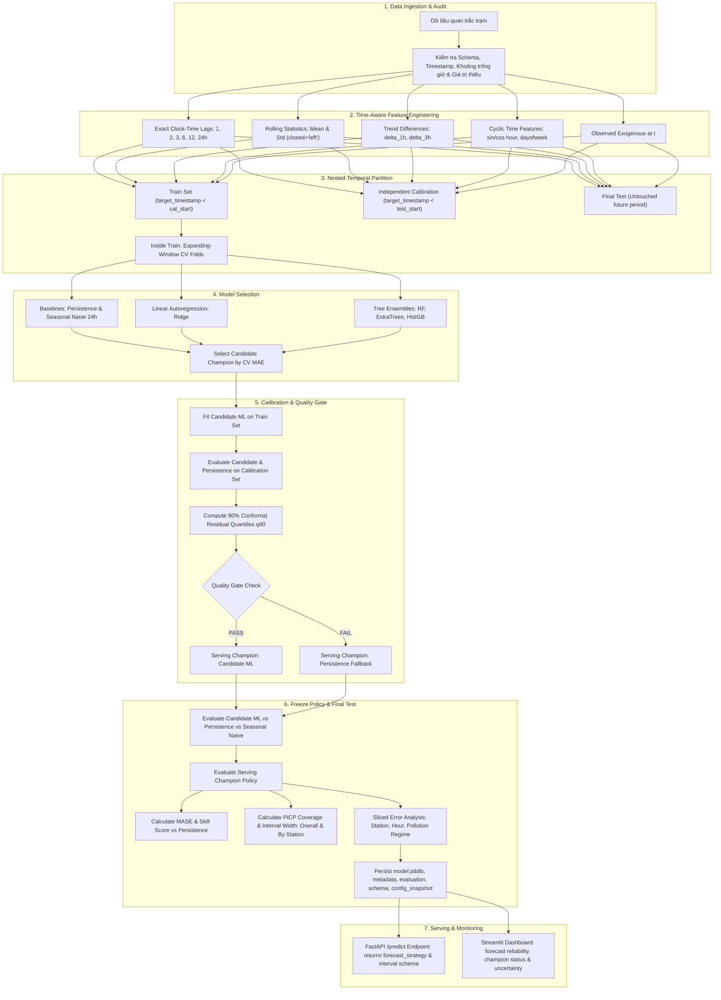

# 🌫️ HCMC Air Quality Forecasting Platform
### Leakage-Safe Next-Hour PM2.5 Forecasting for Ho Chi Minh City with Temporal Backtesting, Persistence-Aware Model Selection, Calibrated Conformal Uncertainty, Quality Gate Guardrails & Production Serving

Dự án là một **Leakage-Safe Temporal ML Forecasting System** hoàn chỉnh được thiết kế chuyên sâu cho bài toán dự báo nồng độ bụi mịn PM2.5 giờ tiếp theo ($t \rightarrow t+1$) theo từng trạm quan trắc tại TP.HCM. Hệ thống giải quyết trọn vẹn các bài toán hóc búa của chuỗi thời gian thực tế: tra cứu lag theo mốc thời gian thực, rolling thống kê không nhìn trước tương lai, expanding-window cross-validation lồng nhau, so sánh baseline persistence, hiệu chuẩn khoảng tin cậy Split Conformal độc lập, cơ chế Quality Gate guardrail tự động fallback, REST API và Dashboard giám sát độ tin cậy.

> ⚠️ **Tuyên bố về Dữ liệu & Định vị Prototype:** Dữ liệu hiện tại (`data/sample/air_quality_sample.csv`) phục vụ **System Validation Prototype** nhằm kiểm tra tính an toàn về rò rỉ dữ liệu, API, CI, artifact và pipeline Conformal; chưa đại diện cho hiệu năng ô nhiễm không khí thực tế của toàn bộ TP.HCM. Các ngưỡng Thấp/Trung bình/Cao là phân nhóm phân tích thử nghiệm nội bộ, không thay thế cho chỉ số AQI chính thức.

---

## 1. 🎯 Định Nghĩa Bài Toán & Phạm Vi Khả Dụng Dữ Liệu (Problem Formulation)

Tại thời điểm $t$, sử dụng dữ liệu quan trắc đã biết đến hết thời điểm $t$ của **một trạm duy nhất** để dự báo nồng độ PM2.5 tại mốc $t+1$ giờ.

```
Quan trắc lịch sử & hiện tại (≤ t)                   Mục tiêu cần dự báo (t+1)
[t-24h] ... [t-2h] [t-1h] [  t  ]                      [ t+1h ]
───────────────────────────────►                         ▼
      Feature Engine (t)           ──────►        Target: PM2.5(t+1)
```

### 1.1 Ràng buộc dữ liệu đầu vào (Input Protocol):
- **Single Station**: Mỗi request / chuỗi chỉ chứa quan trắc của một trạm duy nhất.
- **Strict Clock-Time Monotonicity**: Timestamp tăng dần, liên tục theo từng giờ ($\Delta t = 1\text{h}$).
- **No Duplicate Timestamps**: Tuyệt đối không trùng mốc giờ trong cùng trạm.
- **Non-negative Target**: Nồng độ PM2.5 tại mốc $t$ phải tồn tại và không âm ($y_t \ge 0$).
- **History Sufficiency**: Tối thiểu 25 quan trắc liên tục để đủ lịch sử phục vụ lag 24h và rolling window 24h.

### 1.2 Phân biệt dữ liệu ngoại sinh (Exogenous Feature Availability):
- **Observed Exogenous at $t$**: Nhiệt độ, độ ẩm, $NO_2$, $SO_2$, $CO$, $O_3$, $TSP$ đo được tại mốc $t$ là hợp lệ để đưa vào mô hình.
- **Future Exogenous for $t+1$**: Hệ thống **không** sử dụng thời tiết tại $t+1$ trừ khi dữ liệu đó xuất phát từ nguồn dự báo thời tiết (Numerical Weather Prediction - NWP).

---

## 2. 🏛️ Kiến Trúc Hệ Thống Canonical 7 Giai Đoạn (7-Stage Pipeline)

Toàn bộ quy trình từ dữ liệu thô đến phục vụ suy luận trực tuyến được chuẩn hóa thành 7 giai đoạn duy nhất:



---

## 3. 🔒 Chống Data Leakage Tinh Xảo (Leakage-Safe Engineering)

### 3.1 Clock-Time Lag, Not Row-Position Lag
Nhiều bài toán time-series sinh viên mắc lỗi dùng `df['pm25'].shift(24)`. Nếu dữ liệu bị mất kết nối 3 giờ, hàm `shift(24)` sẽ lấy nhầm quan trắc cách đó 27 giờ thực tế.
- Trong repo này, mọi lag được tra cứu theo khóa mốc thời gian thực:
  $$\text{Key} = (\text{station}, \text{timestamp} - \text{lag})$$
- Nếu thiếu dữ liệu tại mốc thời gian chính xác đó, đặc trưng nhận giá trị `NaN` thay vì lấy nhầm hàng gần nhất.

### 3.2 Rolling Window với `closed="left"` vs Current PM2.5
- Hàm rolling sử dụng `closed="left"`:
  ```python
  series.rolling(f"{window}h", closed="left", min_periods=1).mean()
  ```
  Điều này đảm bảo quan trắc tại thời điểm hiện tại $t$ **hoàn toàn không được tính vào lịch sử rolling**.
- **Current PM2.5 tại $t$**: Giá trị nồng độ $y_t$ vẫn được cung cấp riêng biệt như một đặc trưng hiện tại hợp lệ, vì bài toán là dùng trạng thái tại $t$ để dự báo cho mốc $t+1$.

### 3.3 Chống Rò Rỉ Biên Target Timestamp (Target-Boundary Leakage Prevention)
Hàng dữ liệu tại mốc feature $t = 10:00$ có target tại $t+1 = 11:00$. Nếu tập validation bắt đầu lúc $11:00$, thì hàng dữ liệu này **không được phép nằm trong tập train** (vì target của nó chạm vào thời điểm bắt đầu của validation).
Hệ thống áp dụng bộ lọc biên nghiêm ngặt:
$$\text{train\_mask}: \text{target\_timestamp} < \text{validation\_start}$$
$$\text{train\_split\_mask}: \text{target\_timestamp} < \text{calibration\_start}$$
$$\text{cal\_split\_mask}: \text{target\_timestamp} < \text{test\_start}$$

---

## 4. 📐 Công Thức Toán Học Các Baseline (Baselines Mathematical Formulation)

Để chứng minh tính cần thiết và giá trị thực tế của Machine Learning, hệ thống bắt buộc đối sánh trực tiếp với 3 mô hình nền tảng:

### 4.1 Baseline 1: Persistence (Naive t)
Dự báo nồng độ giờ tới bằng chính nồng độ quan sát được tại giờ hiện tại:
$$\hat{y}_{t+1}^{\text{persistence}} = y_t$$

### 4.2 Baseline 2: Seasonal Naive 24h (t - 23h)
Dự báo nồng độ tại mốc $t+1$ bằng nồng độ tại **cùng giờ ngày hôm trước** (cách mốc mục tiêu đúng 24 giờ):
$$\hat{y}_{t+1}^{\text{seasonal24}} = y_{(t+1) - 24\text{h}} = y_{t - 23\text{h}}$$
> 💡 *Lưu ý quan trọng:* Trong code, tham số `offset_hours = -23` từ mốc thời điểm hiện tại $t$ chính là quan trắc tại $t - 23\text{h}$, tương đương đúng $(t+1) - 24\text{h}$. Đây là công thức chuẩn xác, không phải lỗi offset.

### 4.3 Baseline 3: Ridge Autoregression
Mô hình tuyến tính phạt $L_2$ chuẩn hóa đặc trưng bằng `StandardScaler`:
$$\min_{w} \|Xw - y\|_2^2 + \alpha \|w\|_2^2$$
Mô hình này giúp trả lời câu hỏi cốt lõi: *Tree-based ensemble (Random Forest, ExtraTrees, HistGB) có thực sự cần thiết và vượt trội hơn một mô hình hồi quy tự tương quan tuyến tính đơn giản không?*

---

## 5. 🔀 Giao Thức Phân Chia Dữ Liệu (Nested Temporal Evaluation Protocol)

Thay vì chia ngẫu nhiên (gây data leakage nghiêm trọng) hoặc chia 3 tập tĩnh sơ sài, hệ thống áp dụng **Nested Temporal Evaluation Protocol**:

```
Toàn bộ chuỗi thời gian (Full Data Timeline)
┌───────────────────────────────────────┬──────────────┬──────────────┐
│             TRAIN SET                 │ CALIBRATION  │  FINAL TEST  │
│  ┌─────────┐ ┌─────────┐ ┌─────────┐  │              │              │
│  │ Fold 1  │ │ Fold 2  │ │ Fold 3  │  │              │              │
│  │ Trn|Val │ │ Trn |Val│ │ Trn  |Val│ │  (Untouched) │  (Untouched) │
└───────────────────────────────────────┴──────────────┴──────────────┘
 ◄──────── Expanding-Window CV ────────► ◄── QG & CP ──► ◄── Eval ────►
```

1. **Train Set**: Chứa các chuỗi thời gian ban đầu để xây dựng mô hình và tối ưu siêu tham số thông qua Expanding-Window Cross-Validation.
2. **Independent Calibration Set**: Tập dữ liệu nằm kế tiếp tập Train theo thứ tự thời gian. Dùng để:
   - Hiệu chuẩn phần dư tính toán khoảng tin cậy Conformal Prediction.
   - Thẩm định Quality Gate khách quan mà không làm thiên lệch kết quả kiểm định cuối.
3. **Final Test Set**: Tập dữ liệu tương lai cuối cùng chưa từng được tiếp xúc trong bất kỳ khâu huấn luyện hay hiệu chuẩn nào.

---

## 6. 🛡️ Quality Gate & Cơ Chế Fallback Triển Khai (Deployment Guardrails)

Hệ thống thiết lập nguyên tắc MLOps thực chiến: **Machine Learning chỉ được phép triển khai suy luận nếu thực sự tạo ra giá trị vượt trội hơn các quy luật tự nhiên đơn giản (Persistence).**

| Tiêu chí Guardrail | Ngưỡng yêu cầu (Configurable) | Ý nghĩa thực tế |
|---|:---:|---|
| **MAE Improvement** | $\frac{MAE_{\text{pers}} - MAE_{\text{model}}}{MAE_{\text{pers}}} \ge 5\%$ | Mô hình phải giảm sai số ít nhất 5% so với Persistence |
| **High PM2.5 Recall** | $\text{Recall}_{\text{Cao}} \ge 75\%$ | Cảnh báo được ít nhất 75% các đợt ô nhiễm nặng |
| **Rolling MAE Stability**| $\text{Std}(MAE_{\text{folds}}) \le 1.0$ | Sai số ổn định qua các cửa sổ thời gian, không trồi sụt |

### Cơ chế Quyết định Serving Champion:
- **PASS**: Toàn bộ tiêu chí đạt $\rightarrow$ `serving_champion` = `candidate_ml` (sử dụng quantile phần dư của ML).
- **FAIL**: Một trong các tiêu chí không đạt $\rightarrow$ `serving_champion` = `persistence` (hệ thống tự động kích hoạt fallback về baseline persistence an toàn và dùng quantile phần dư của persistence).

---

## 7. 📊 Kết Quả Đánh Giá Tập Test Cuối (Freeze-Policy Final Test)

Báo cáo thử nghiệm trên tập dữ liệu kiểm thử kỹ thuật (`air_quality_sample.csv`):

### 7.1 Bảng so sánh đa mô hình trên Test Set:

| Chiến lược / Mô hình | MAE | RMSE | MASE | Skill vs Pers | Macro-F1 | Recall PM2.5 Cao |
|---|---:|---:|---:|---:|---:|---:|
| Ứng viên ML (`ridge`) | **0.316** | **0.317** | **1.264** | **-26.4%** | **0.667** | **100.0%** |
| Persistence Baseline ($t+1 = t$) | 0.250 | 0.292 | 1.000 | 0.0% | 0.667 | 100.0% |
| Seasonal Naive 24h ($t+1 = t-23\text{h}$) | 5.948 | 5.952 | 23.790 | -2279.0% | 0.222 | 0.0% |
| 🏆 **Actual Serving Champion** | **0.316** | **0.317** | **1.264** | **-26.4%** | **0.667** | **100.0%** |

- **MASE (Mean Absolute Scaled Error)**: $\frac{MAE_{\text{model}}}{MAE_{\text{persistence}}}$ (giá trị $< 1$ thể hiện mô hình đánh bại naive).
- **MAE Skill Score**: $1 - \frac{MAE_{\text{model}}}{MAE_{\text{persistence}}}$.
- **Headline Metrics**: Báo cáo ưu tiên các chỉ số hồi quy (MAE, RMSE, Bias, P90 AE). Phân lớp 3 mức (Thấp/Trung bình/Cao) chỉ đóng vai trò diễn giải nghiệp vụ hạ tầng.

---

## 8. 🎯 Hiệu Chuẩn Khoảng Tin Cậy Conformal (Conformal Prediction)

Thay vì chỉ dự báo một con số điểm (point forecast), hệ thống cung cấp khoảng tin cậy có bảo đảm toán học bằng phương pháp **Split Conformal Prediction**:
$$\hat{C}(X_{t+1}) = [\hat{y}_{t+1} - q_{90}, \; \hat{y}_{t+1} + q_{90}]$$
Trong đó $q_{90}$ là quantile bậc 90% của phân phối phần dư tuyệt đối tính trên **tập Calibration độc lập**.

### 8.1 Kết quả kiểm định thực tế trên tập Test cuối:
- **Độ phủ mục tiêu (Target Coverage):** $90.0\%$
- **Độ phủ thực tế trên tập Test (PICP):** $75.0\%$ *(trên mẫu thử nghiệm test nhỏ)*
- **Độ rộng khoảng tin cậy trung bình (MPIW):** $0.650 \;\mu\text{g/m}^3$ ($\pm 0.325 \;\mu\text{g/m}^3$)
- **Độ rộng khoảng tin cậy trung vị:** $0.650 \;\mu\text{g/m}^3$

### 8.2 Độ phủ phân rã theo từng trạm:
- **Trạm A**: PICP = $75.0\%$, MPIW = $\pm 0.325 \;\mu\text{g/m}^3$
- **Trạm B**: PICP = $75.0\%$, MPIW = $\pm 0.325 \;\mu\text{g/m}^3$

> 💡 *Lưu ý về phạm vi hiệu lực:* Split Conformal cơ bản cung cấp **Marginal Coverage** trên toàn bộ phân phối; với tập dữ liệu lớn trong tương lai, hệ thống sẽ nâng cấp lên **Per-station Conformal** và **Conditional Regime Conformal** để bảo đảm từng mức ô nhiễm đều đạt chuẩn 90%.

---

## 9. 🏢 Kiến Trúc Triển Khai MLOps: Offline vs Online

Hệ thống bảo đảm tính đồng nhất tuyệt đối (**Training-Serving Consistency**) nhờ tái sử dụng chung một Feature Engine:

```
[ OFFLINE TRAINING PIPELINE ]
Historical CSV / DB
        │
        ▼
   Data Audit ──────────► [Schema & Quality Checks]
        │
        ▼
Shared Feature Engine ──► [Exact Lags, Rolling Left, Deltas, Cyclic]
        │
        ▼
Nested Temporal Split ──► [Train + CV, Calibration, Final Test]
        │
        ▼
 Model Selection ───────► [Persistence, Seasonal Naive, Ridge, RF, ExtraTrees, HistGB]
        │
        ▼
Independent Calibration ─► [Residual Quantile q90]
        │
        ▼
  Quality Gate ─────────► [PASS: Candidate ML | FAIL: Persistence Fallback]
        │
        ▼
 Freeze Final Test ─────► [MAE, RMSE, MASE, Skill, PICP, Sliced Errors]
        │
        ▼
 Artifact Registry ─────► [model.joblib, metadata.json, evaluation.json, feature_schema.json]


[ ONLINE FORECASTING SERVING ]
Latest Sensor Readings (Last 25 Hours)
        │
        ▼
 Pydantic Validator ────► [Single Station, Strict 1h gaps, Positive PM2.5]
        │
        ▼
Shared Feature Engine ──► [build_features() with include_target=False]
        │
        ▼
Serving Predictor ──────► [Evaluate model or persistence according to serving_champion]
        │
        ▼
Conformal Interval ─────► [predicted ± residual_quantile]
        │
        ▼
 FastAPI /predict ──────► [JSON: forecast_strategy, predicted_pm25, interval, level]
        │
        ▼
Streamlit Dashboard ────► [Interactive Time-Series, Uncertainty Bands & Guardrails]
```

### Kiến trúc mục tiêu Production (Target Architecture):
```
Sensors / OpenAQ API ──► Kafka / Ingestion Worker ──► TimescaleDB / InfluxDB
                                                             │
Dashboard & Alerts ◄────── FastAPI Serving Engine ◄──────────┘
```

---

## 10. 🌐 REST API & Dashboard Giám Sát

### 10.1 Khởi chạy FastAPI Service:
```bash
uvicorn app.api:app --reload --port 8000
```
- Swagger UI tài liệu tương tác: [http://localhost:8000/docs](http://localhost:8000/docs)
- Endpoint kiểm tra sức khỏe: `GET /health`
- Endpoint dự báo: `POST /predict`

**Contract phản hồi chuẩn (`PredictionResponse`):**
```json
{
  "station": "Trạm A",
  "forecast_origin": "2024-01-02T10:00:00",
  "forecast_for": "2024-01-02T11:00:00",
  "current_pm25": 32.1,
  "predicted_pm25": 34.7,
  "level": "Trung bình",
  "forecast_strategy": "ml_model",
  "serving_champion": "ridge",
  "interval": {
    "method": "split_conformal",
    "coverage_target": 0.9,
    "coverage": 0.9,
    "lower": 34.37,
    "upper": 35.03,
    "width": 0.65
  },
  "model_version": "pm25-20260905-c3f8e4f-ed3c52b",
  "updated_at": "2026-09-05T11:58:09.689498+00:00"
}
```

### 10.2 Khởi chạy Dashboard Streamlit:
```bash
streamlit run app/dashboard.py
```
- Dashboard hiển thị chuỗi quan trắc 25 giờ gần nhất, điểm dự báo $t+1$, dải bất định Conformal 90%, badge thông báo trạng thái `Serving Champion` và các chỉ số độ tin cậy.

---

## 11. 🧪 Bộ Kiểm Thử Độ Tuân Thủ Chuẩn Mực (12 Compliance Tests)

Hệ thống tích hợp bộ unit test nghiêm ngặt tại `tests/test_audit_and_compliance.py`:
1. `test_exact_hour_lag_does_not_shift_over_gap`: Xác nhận lag trả về `NaN` khi có khoảng trống giờ, không dịch dòng nhầm.
2. `test_rolling_feature_excludes_current_observation`: Kiểm tra `closed="left"` loại trừ triệt để quan sát hiện tại $t$.
3. `test_target_timestamp_never_crosses_split_boundary`: Đảm bảo `target_timestamp` của train luôn nhỏ hơn `calibration_start` và `test_start`.
4. `test_backtest_train_before_validation`: Expanding folds trong tập train luôn tuân thủ quan hệ nhân quả.
5. `test_calibration_before_test`: Tập Calibration nằm hoàn toàn trước tập Test cuối.
6. `test_test_never_used_for_model_selection`: Tập Test cuối không bao giờ bị sử dụng để chọn candidate model.
7. `test_seasonal_naive_same_hour_previous_day`: Xác minh công thức toán học $\hat{y}_{t+1} = y_{t-23}$.
8. `test_persistence_baseline`: Xác minh $\hat{y}_{t+1} = y_t$.
9. `test_quality_gate_fallback_to_persistence`: Quality gate tự động kích hoạt fallback persistence khi mô hình yếu.
10. `test_serving_champion_test_metrics_match_policy`: Test metrics của serving champion phản ánh trung thực policy (sửa lỗi P0).
11. `test_conformal_interval_uses_correct_champion_residuals`: Khoảng tin cậy dùng đúng phân phối phần dư của serving champion tương ứng.
12. `test_train_and_inference_feature_columns_match`: Cột đặc trưng khớp 100% giữa pipeline train và Predictor serving.

---

## 12. 🗺️ Lộ Trình Phát Triển (Technical Roadmap)

| Mức độ | Hạng mục công việc | Trạng thái |
|:---:|---|:---:|
| 🔴 **P0** | Sửa báo cáo để `serving_champion_test` phản ánh đúng actual serving policy | ✅ **Hoàn thành** |
| 🔴 **P0** | Giải thích Seasonal Naive $t-23\text{h}$ bằng công thức toán học tường minh | ✅ **Hoàn thành** |
| 🔴 **P0** | Chuẩn hóa thuật ngữ split: Train + expanding CV / Calibration / Final Test | ✅ **Hoàn thành** |
| 🔴 **P0** | Báo cáo Conformal test coverage (PICP) và độ rộng khoảng (MPIW) trên test set | ✅ **Hoàn thành** |
| 🔴 **P0** | API và Predictor trả về `forecast_strategy` và cấu trúc `interval` chi tiết | ✅ **Hoàn thành** |
| 🟠 **P1** | Bổ sung Ridge Autoregression baseline vào model selection | ✅ **Hoàn thành** |
| 🟠 **P1** | Thêm các chỉ số chuẩn time-series: MASE và Skill Score vs Persistence | ✅ **Hoàn thành** |
| 🟠 **P1** | Bổ sung trend deltas (`delta_1h`, `delta_3h`) và rolling std (`closed='left'`) | ✅ **Hoàn thành** |
| 🟠 **P1** | Phân tích lỗi đa chiều Sliced Error Analysis (Station, Hour, Pollution level) | ✅ **Hoàn thành** |
| 🟠 **P1** | Tự động sinh `model_version` từ timestamp + git SHA + data hash | ✅ **Hoàn thành** |
| 🟠 **P1** | Xuất thêm artifact: `feature_schema.json` và `config_snapshot.yaml` | ✅ **Hoàn thành** |
| 🟠 **P1** | Bộ 12 ca kiểm thử bắt buộc (Architectural Compliance Suite) | ✅ **Hoàn thành** |
| 🟡 **P2** | Multi-horizon forecasting ($t+1, t+3, t+6, t+12, t+24\text{h}$) | ⏳ *Kế hoạch kế tiếp* |
| 🟡 **P2** | Tích hợp nguồn dữ liệu quan trắc thực tế OpenAQ TP.HCM | ⏳ *Kế hoạch kế tiếp* |
| 🟡 **P2** | Per-station Conformal Calibration & InfluxDB/TimescaleDB Storage | ⏳ *Kế hoạch kế tiếp* |
| 🟡 **P3** | Benchmark Deep Learning chuyên dụng: Temporal Fusion Transformer / N-BEATS | ⏳ *Nghiên cứu sâu* |

---

## 13. 🛠️ Hướng Dẫn Cài Đặt & Chạy (Quick Start)

### 13.1 Khởi tạo môi trường ảo
```bash
python -m venv .venv
# Windows PowerShell:
.venv\Scripts\activate
# Linux/macOS:
# source .venv/bin/activate

pip install -r requirements-dev.txt
```

### 13.2 Kiểm tra chất lượng mã nguồn & Unit Tests
```bash
# Kiểm tra linting
python -m ruff check src app tests

# Chạy toàn bộ 37 ca kiểm thử
python -m pytest

# Chạy kiểm định tính tái lập độc lập
python -m pytest tests/test_reproducibility.py
```

### 13.3 Huấn luyện & Sinh Báo Cáo
```bash
# Huấn luyện mô hình và lưu artifacts
python -m src.train --config configs/config.yaml

# Xuất báo cáo đánh giá chuyên sâu
python -m src.report --input artifacts/evaluation.json --output reports/evaluation_summary.md
```

### 13.4 Chạy với Docker Compose
```bash
docker compose up --build
```
- API: `http://localhost:8000`
- Dashboard: `http://localhost:8501`

---

## 14. 📝 Hướng Dẫn Nêu Bật Dự Án Trong CV (Resume STAR Format)

- **Machine Learning Engineer**:
  > *"Xây dựng nền tảng dự báo nồng độ ô nhiễm PM2.5 trước 1 giờ ($t+1\text{h}$) theo từng trạm với thiết kế triệt tiêu Data Leakage theo mốc thời gian thực (Exact Clock-time Lags, Rolling closed='left'), Expanding-Window Backtesting và đóng gói trọn gói bằng Scikit-Learn Pipeline."*
- **MLOps & Uncertainty Estimation**:
  > *"Thiết kế cơ chế Quality Gate đa tiêu chí tự động fallback về Persistence Baseline khi mô hình không tạo ra giá trị nghiệp vụ; định lượng độ không chắc chắn bằng Split Conformal Prediction độc lập cung cấp khoảng tin cậy 90% đã được kiểm chứng độ phủ thực tế trên tập Test."*
- **Software Engineering & Serving**:
  > *"Product hóa mô hình thành REST API hiệu năng cao (FastAPI) trả về thông tin chiến lược suy luận (forecast_strategy) & khoảng tin cậy, Dashboard tương tác giám sát độ tin cậy (Streamlit/Plotly), container hóa toàn bộ bằng Docker Compose và thiết lập quy trình CI kiểm định 12 ca kiểm thử chống rò rỉ dữ liệu."*

---

## 📜 Giấy Phép & Tuyên Bố Miễn Trừ (License & Disclaimer)

Dự án phát hành theo giấy phép [MIT License](LICENSE). 
Dữ liệu trong `data/sample/air_quality_sample.csv` là dữ liệu tổng hợp phục vụ kiểm tra kỹ thuật. Khi triển khai trên dữ liệu thực tế của TP.HCM, người dùng cần tuân thủ bản quyền và điều khoản phát hành của đơn vị đo đạc gốc.
