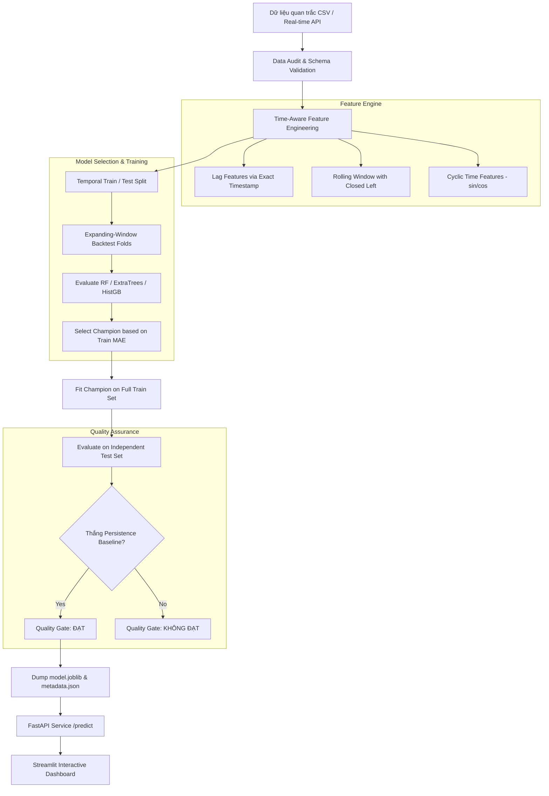

# 🌫️ Leakage-Safe Next-Hour PM2.5 Forecasting for Ho Chi Minh City

Dự án nghiên cứu & triển khai mô hình học máy **Dự báo nồng độ ô nhiễm PM2.5 trước 1 giờ (\(t+1\))** theo từng trạm quan trắc tại TP.HCM. Dự án được thiết kế chuẩn mực theo tiêu chí **Production-Grade Data Mining & MLOps**, tập trung vào tính **Leakage-Safe (Chống rò rỉ dữ liệu chuỗi thời gian)**, **Train-Serving Parity**, **Quality Gate tự động** và **Khả năng đóng gói thương mại**.

> ⚠️ **Lưu ý phạm vi:** Mô hình phục vụ mục đích nghiên cứu, học thuật và trình diễn kỹ thuật Machine Learning Engineering. Không sử dụng làm hệ thống cảnh báo sức khỏe công cộng chính thức khi chưa được kiểm định độc lập trên dữ liệu thực tế lớn.

---

## 🌟 Điểm Nổi Bật Kỹ Thuật (Key Technical Highlights)

- 🔒 **Chống Leakage Dữ Liệu Thời Gian Tuyệt Đối**:
  - Tra cứu lag (1, 2, 3, 6, 12, 24 giờ) và rolling features (3, 6, 24 giờ) theo mốc thời gian thực (`timestamp` thực tế), **không dịch chuyển theo vị trí dòng**. Tránh rò rỉ khi chuỗi dữ liệu có khoảng khuyết (gaps).
  - Phân chia Train/Validation/Test theo mốc thời gian duy nhất (`timestamp`), đảm bảo tất cả trạm quan trắc tại cùng một giờ luôn nằm chung một partition.
- 📐 **Train-Serving Parity với Scikit-Learn Pipeline**:
  - Đóng gói toàn bộ Preprocessing (`SimpleImputer`, `OneHotEncoder`) và Model Regressor trong cùng 1 `Pipeline`, loại bỏ hoàn toàn sự lệch lệch giữa môi trường huấn luyện và suy luận thực tế (inference).
- 🏆 **Expanding-Window Backtesting & Quality Gate Tự Động**:
  - Chọn mô hình ứng viên (Random Forest, Extra Trees, HistGradientBoosting) dựa trên trung bình MAE qua expanding time-series folds ở tập train.
  - So sánh trực tiếp với 2 baseline bắt buộc: **Persistence** (\(t+1 = t\)) và **Seasonal Naive 24h** (\(t+1 = t-23h\)).
  - Quality Gate tự động gắn nhãn `không đạt` nếu mô hình champion không vượt qua Persistence trên tập Test độc lập.
- 🚀 **Kiến Trúc MLOps Hoàn Chỉnh**:
  - **REST API**: Khởi tạo bằng FastAPI với Pydantic schema validation và LRU Caching cho Predictor.
  - **Dashboard Trực Quan**: Xây dựng bằng Streamlit & Plotly hiển thị dự báo, mức độ ô nhiễm (Tốt/Trung bình/Xấu) và độ tin cậy tương đối.
  - **Containerization & CI/CD**: Hỗ trợ Docker, Docker Compose, kiểm thử tự động với `pytest` và linting với `ruff`.

---

## 🏗️ Kiến Trúc Hệ Thống (System Architecture)



---

## 🛠️ Hướng Dẫn Cài Đặt & Chạy (Quick Start)

### 1. Khởi tạo môi trường Python (Python 3.11+)

```bash
# Tạo và kích hoạt môi trường ảo
python -m venv .venv

# Windows PowerShell:
.venv\Scripts\activate

# Linux / macOS:
# source .venv/bin/activate

# Cài đặt thư viện phát triển
pip install -r requirements-dev.txt
```

### 2. Kiểm tra chất lượng mã nguồn & Unit Tests

```bash
# Linting với Ruff
python -m ruff check src app tests

# Chạy toàn bộ Unit Tests
python -m pytest

# Test toàn bộ pipeline huấn luyện (Dry-run không ghi artifact)
python -m src.train --config configs/config.yaml --dry-run
```

### 3. Huấn luyện & Đánh giá Mô hình

```bash
# Chạy pipeline huấn luyện thực tế và lưu artifacts
python -m src.train --config configs/config.yaml

# Trích xuất báo cáo Markdown
python -m src.report --input artifacts/evaluation.json --output reports/evaluation_summary.md
```

Artifacts sẽ được sinh ra trong thư mục `artifacts/`:
- `artifacts/model.joblib`: Pipeline mô hình học máy đã huấn luyện.
- `artifacts/metadata.json`: Thống kê SHA-256 dữ liệu, danh sách đặc trưng, khoảng thời gian train/test và kết quả Quality Gate.
- `artifacts/evaluation.json`: Báo cáo chi tiết metrics hồi quy, phân loại, tail-risk và theo từng trạm.

---

## 🌐 Triển Khai API & Dashboard

### 1. Chạy REST API (FastAPI)

```bash
uvicorn app.api:app --reload --port 8000
```
- Swagger UI (Tài liệu tương tác): [http://localhost:8000/docs](http://localhost:8000/docs)
- Endpoint kiểm tra sức khỏe: `GET http://localhost:8000/health`
- Endpoint dự báo: `POST http://localhost:8000/predict`

**Ví dụ gửi Request với `curl`:**
```bash
curl -X POST http://localhost:8000/predict \
  -H "Content-Type: application/json" \
  -d '{
    "observations": [
      {"timestamp": "2024-01-01T00:00:00", "station": "Trạm A", "PM2.5": 20.0},
      {"timestamp": "2024-01-01T01:00:00", "station": "Trạm A", "PM2.5": 22.5}
    ]
  }'
```

### 2. Chạy Dashboard (Streamlit)

Khởi chạy giao diện theo dõi trực quan:

```bash
streamlit run app/dashboard.py
```
- Mở trình duyệt tại: [http://localhost:8501](http://localhost:8501)

---

## 🐳 Triển Khai Với Docker

### Chạy đơn lẻ API Container
```bash
docker build -t hcmc-air-quality-forecast .
docker run --rm -p 8000:8000 hcmc-air-quality-forecast
```

### Chạy đồng thời API & Dashboard với Docker Compose
```bash
docker compose up --build
```
- REST API: `http://localhost:8000`
- Streamlit Dashboard: `http://localhost:8501`

---

## 📊 Cấu Trúc Mã Nguồn Dữ Liệu (Repository Structure)

```text
├── configs/
│   └── config.yaml               # Cấu hình dự án (data paths, features, split, thresholds)
├── data/
│   ├── sample/
│   │   └── air_quality_sample.csv # Dữ liệu tổng hợp thử nghiệm kỹ thuật
│   └── README.md                 # Data Card & hướng dẫn giấy phép dữ liệu
├── notebooks/
│   └── 01_experiment.ipynb       # Notebook phân tích khám phá & giải thích thí nghiệm
├── src/                          # Mã nguồn cốt lõi (Module hóa sạch)
│   ├── data.py                   # Data audit, config loading & schema validation
│   ├── features.py               # Time-aware feature engineering (Chống leakage)
│   ├── models.py                 # Khởi tạo mô hình học máy (RF, ExtraTrees, HistGB)
│   ├── train.py                  # Pipeline huấn luyện, backtest & quality gate
│   ├── evaluate.py               # Metrics hồi quy, phân loại, tail risk & baseline
│   ├── predict.py                # Wrapper suy luận (Predictor) cho API/Serving
│   ├── report.py                 # Sinh báo cáo Markdown tổng hợp
│   └── utils.py                  # Utility functions (SHA-256 fingerprinting)
├── app/                          # Ứng dụng giao diện & Web API
│   ├── api.py                    # FastAPI Service
│   └── dashboard.py              # Streamlit Web App
├── tests/                        # Unit tests & integration tests (pytest)
│   ├── test_features.py          # Kiểm thử chống leakage và lag theo giờ
│   ├── test_prediction.py        # Kiểm thử API & Predictor
│   ├── test_report.py            # Kiểm thử sinh báo cáo
│   └── test_training_protocol.py # Kiểm thử expanding backtest & time split
├── docs/                         # Tài liệu hệ thống
│   ├── MODEL_CARD.md             # Model Card chi tiết
│   └── PORTFOLIO.md              # Hướng dẫn trình bày dự án trong CV & phỏng vấn
├── Dockerfile                    # Containerization spec
├── docker-compose.yml            # Multi-container service orchestration
├── pyproject.toml                # Tooling config (Ruff, pytest)
├── requirements.txt              # Thư viện runtime
└── requirements-dev.txt          # Thư viện phát triển & kiểm thử
```

---

## 📝 Hướng Dẫn Nêu Nổi Bật Dự Án Trong CV (Resume / LinkedIn)

Khi đưa dự án này vào **CV (Resume)** hoặc hồ sơ **LinkedIn**, bạn nên trình bày theo chuẩn Google STAR / XYZ format:

### Mẫu Bullet Points Cho CV:
- **Machine Learning Engineer**:
  > *"Xây dựng pipeline dự báo nồng độ ô nhiễm PM2.5 trước 1 giờ (t+1h) theo từng trạm với thiết kế chống Data Leakage theo mốc thời gian thực, expanding-window backtesting và đóng gói trọn gói bằng Scikit-Learn Pipeline."*
- **MLOps & Productization**:
  > *"Product hóa mô hình học máy thành dịch vụ REST API (FastAPI) & Dashboard tương tác (Streamlit/Plotly), container hóa toàn bộ bằng Docker Compose và thiết lập quy trình CI (Ruff, Pytest) kiểm tra độ phủ schema và rò rỉ dữ liệu."*
- **Data Mining / Data Science**:
  > *"Thiết kế quy trình kiểm thử Quality Gate khắt khe so sánh mô hình học máy trực tiếp với các baseline chuỗi thời gian (Persistence & Seasonal Naive 24h), phân tích rủi ro ô nhiễm cực đoan (Tail Risk Recall) và đo lường metric riêng cho từng trạm quan trắc."*

---

## 📜 Giấy Phép & Tuyên Bố Miễn Trừ (License & Disclaimer)

Dự án phát hành theo giấy phép [MIT License](LICENSE). 
Dữ liệu trong `data/sample/air_quality_sample.csv` là dữ liệu tổng hợp chỉ dùng cho mục đích kiểm tra kỹ thuật. Khi sử dụng dữ liệu ô nhiễm không khí thực tế tại TP.HCM, người dùng có trách nhiệm tuân thủ bản quyền và điều khoản phát hành của đơn vị cung cấp dữ liệu gốc.
